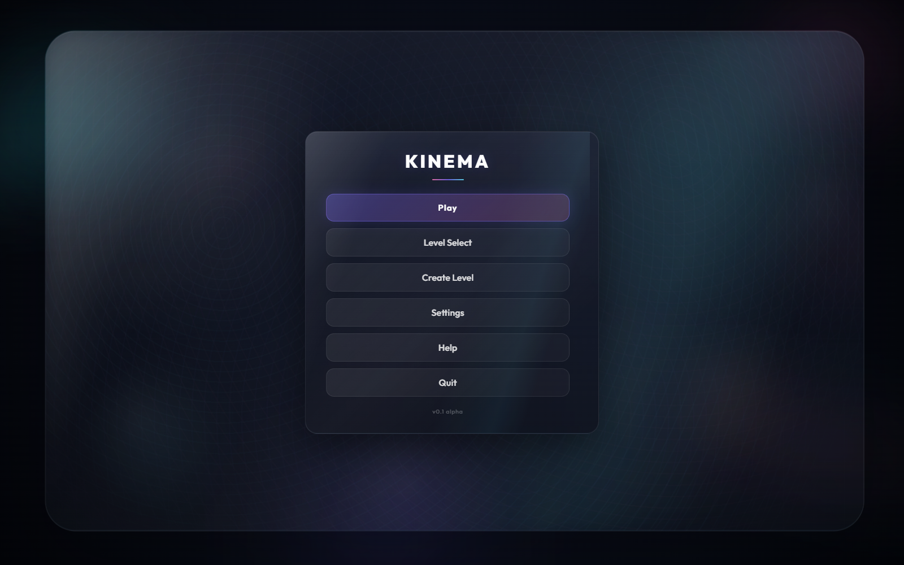
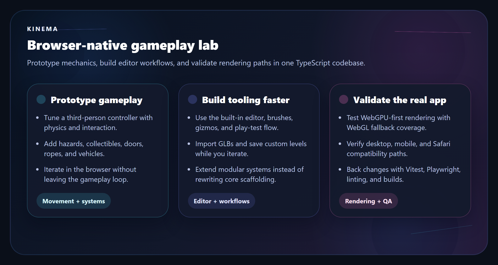
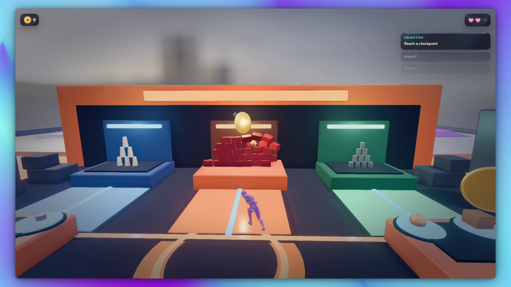
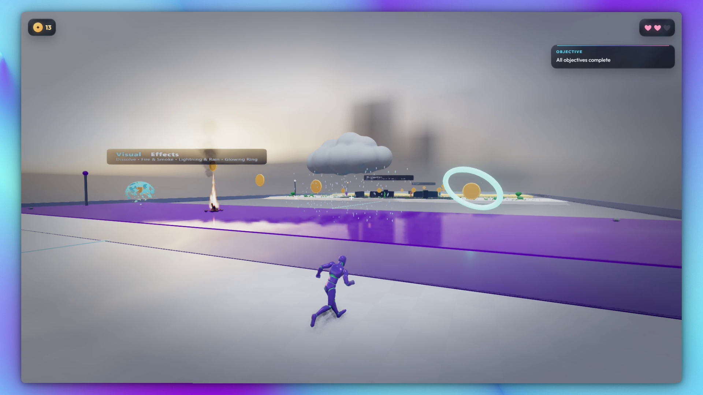
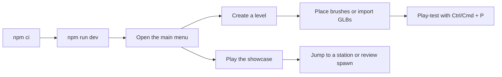
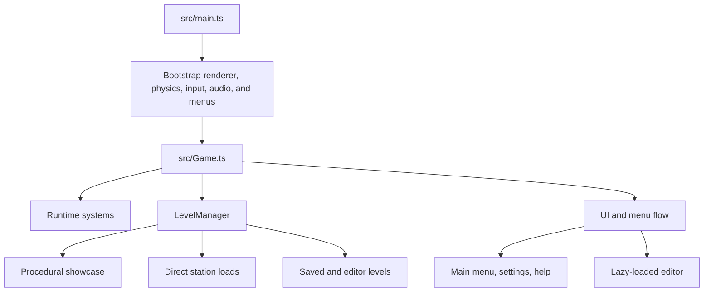

# Kinema

Kinema is a browser-native third-person gameplay lab built with TypeScript, Three.js, Rapier, Tone.js, and Vite. It combines a WebGPU-first runtime, a compatibility WebGL path, and an in-browser level editor so developers can prototype mechanics, iterate on content, and validate rendering behavior in one codebase.

**Why this repo is worth opening:**

- Prototype movement, interaction, hazards, vehicles, and collectibles in a real browser runtime.
- Build and play-test levels in the same app instead of maintaining separate editor tooling.
- Debug both modern rendering paths and Safari-friendly compatibility behavior.
- Back changes with unit tests, browser tests, linting, and a production build.





## In-Game Snapshots

| Target Arena | VFX Showcase |
|---|---|
|  |  |
| Color-coded challenge bay with collectible routing, target stacks, and arena-style readability. | Showcase bay highlighting the project's stylized effects language and feature-station presentation. |

## Use Kinema when you want to...

| Goal | Kinema gives you |
|---|---|
| Prototype a third-person controller | Character movement, jumping, crouching, ladders, ropes, camera follow, and interaction-ready physics |
| Build browser-based gameplay systems | Runtime systems for checkpoints, hazards, collectibles, prompts, debug tooling, and more |
| Explore rendering and graphics tradeoffs | WebGPU-first rendering, WebGL fallback, graphics profiles, post-processing, HDR environments, and debug controls |
| Create or test level-editing workflows | An in-browser editor with brushes, gizmos, hierarchy, inspector, undo/redo, GLB import, and play-test mode |
| Validate real-world compatibility | Keyboard and mouse, gamepad, mobile touch controls, and Safari/Apple compatibility coverage |
| Study a modular game architecture | Clear domains for gameplay, rendering, input, editor, systems, UI, and tests |

## What You Can Explore In 5 Minutes

1. Run the app locally and open the procedural showcase corridor.
2. Jump directly to a feature station such as vehicles or VFX with a query param.
3. Open the editor with `F1`, place geometry, and play-test with `Ctrl+P` or `Cmd+P`.
4. Flip to the compatibility path with `?forceWebGL=1` and compare behavior.



## Core Highlights

| Area | Highlights |
|---|---|
| Gameplay | Character controller, checkpoints, hazards, collectibles, doors, ropes, and grab/carry/throw interactions |
| Vehicles | Driveable car and hover drone |
| World | Procedural showcase corridor with 14 feature stations |
| Editor | Brush placement, GLB import, transform gizmo, undo/redo, save/load, and play-test mode |
| Rendering | WebGPU-first renderer, WebGL fallback, graphics profiles, post-processing, HDR environments |
| Input | Keyboard and mouse, gamepad, and mobile touch controls |
| Tooling | Vitest unit tests, Playwright browser tests, and Biome linting |

## Quick Start

### Requirements

- Node.js 20+
- npm 10+
- A modern browser. Chrome or Edge is best for the full WebGPU path. Safari and Apple mobile browsers automatically use the compatibility renderer.

### Install and run

```bash
npm ci
npm run dev
```

Open `http://127.0.0.1:5173`.

### First run checklist

1. Click `Play` to load the procedural showcase.
2. Click the canvas to engage pointer lock and audio.
3. Press `F1` to open the editor.
4. Press `Ctrl+P` or `Cmd+P` in the editor to play-test.
5. Press `` ` `` to open the debug panel.

## Developer Workflow

### Useful scripts

| Command | What it does |
|---|---|
| `npm run dev` | Start the local Vite dev server |
| `npm run build` | Type-check and create the production build in `dist/` |
| `npm run preview` | Preview the production build locally |
| `npm run test` | Run Vitest unit tests in `src/**/*.test.ts` |
| `npm run test:watch` | Run Vitest in watch mode |
| `npm run lint` | Run Biome checks on `src/` |
| `npm run lint:fix` | Apply Biome fixes on `src/` |
| `npx playwright test` | Run Playwright browser coverage from `tests/` |

Install the Playwright browser once with:

```bash
npx playwright install chromium
```

### Useful local URLs

Append these to your local dev URL when you want a faster repro:

| Path | Use it for |
|---|---|
| `/` | Normal startup through the main menu |
| `/?station=vehicles` | Jump straight into one showcase station |
| `/?station=vfx` | Isolate rendering and particle-heavy content |
| `/?spawn=overviewMid` | Load the procedural showcase from a review spawn |
| `/?forceWebGL=1` | Force the compatibility renderer |
| `/?experimentalRenderer=1` | Opt Safari into the experimental renderer for debugging |

### Dev-only debug surface

In dev builds, `window.__KINEMA__` exposes helpers used by tests and debugging flows, including player state, teleports, vehicle inspection, graphics profile toggles, and input simulation helpers.

## Architecture



### Repo map

| Path | Responsibility |
|---|---|
| `src/core/` | Shared types, constants, event bus, settings, and the fixed-step game loop |
| `src/character/` | Player controller, locomotion modes, and FSM states |
| `src/interaction/` | Focus detection and interactables such as doors, ropes, vehicles, and throwable objects |
| `src/vehicle/` | Car and drone controllers plus vehicle orchestration |
| `src/level/` | Procedural showcase layout, level loading, lighting, checkpoints, and asset loading |
| `src/editor/` | In-browser level editor, brushes, tools, panels, and serialization |
| `src/renderer/` | Renderer bootstrapping, profiles, post-processing, and compatibility behavior |
| `src/ui/` | HUD, loading states, menus, and debug panel |
| `src/systems/` | Runtime feature systems registered by `src/Game.ts` |
| `public/assets/` | Models, HDR environments, LUTs, sprites, and other static assets |
| `tests/` | Playwright browser coverage and screenshot-oriented verification |

Path aliases are configured in `tsconfig.json` and `vite.config.ts` for `@core`, `@character`, `@level`, `@renderer`, `@editor`, and the other top-level domains under `src/`.

## Contribution Entry Points

| If you want to change... | Start here |
|---|---|
| Movement tuning or physics feel | `src/core/constants.ts`, `src/character/`, and `src/physics/` |
| Procedural showcase layout | `src/level/ShowcaseLayout.ts` and `src/level/ProceduralBuilder.ts` |
| Runtime feature systems | `src/systems/` and registration in `src/Game.ts` |
| Rendering or post-processing | `src/renderer/` |
| Editor behavior or tools | `src/editor/` and `src/editor/tools/` |
| UI, menus, and HUD | `src/ui/` |
| Interactables | `src/interaction/interactables/` |
| Vehicles | `src/vehicle/` |

## Testing And Verification

Use this as the standard pre-merge pass:

```bash
npm run test
npm run lint
npm run build
npx playwright test
```

Notes:

- Playwright auto-starts the Vite dev server through `playwright.config.ts`.
- Unit tests live beside source files as `*.test.ts`.
- Browser coverage in `tests/` is especially useful for procedural loads, controls, mobile layouts, and rendering regressions.

## Essential Controls

| Input | Action |
|---|---|
| `W A S D` | Move |
| Mouse | Look |
| `Space` | Jump |
| `Shift` | Sprint or vehicle boost |
| `F` | Interact, grab, or enter/exit vehicles |
| `C` / `Left Ctrl` | Crouch or handbrake |
| `Escape` | Pause menu |
| `` ` `` | Debug panel |
| `F1` | Toggle editor |

Use the in-app `Help` menu for the full control reference, including rope, vehicle, gamepad, and mobile touch mappings.

## Compatibility Notes

- Kinema is WebGPU-first, with a compatibility WebGL path for browsers that need it.
- Safari and Apple mobile browsers default to the compatibility renderer because that path is more reliable today.
- Imported GLBs are session-local unless you add them under `public/assets/models/`.
- The editor is desktop-first; mobile support is focused on gameplay and validation rather than full editing workflows.

## Credits

- Universal Animation Library and Universal Animation Library 2 animation packs by @Quaternius (CC0 1.0), downloaded from itch.io
- Cloud lightning model by Kyyy_24 (CC BY 4.0)
- Smoke particle textures by Kenney (CC0)
- Fire shader inspiration from Shadertoy "Night Campfire" by Maurogik

## License

Released under the [MIT License](LICENSE). Copyright (c) 2026 Pranshul Chandhok.
