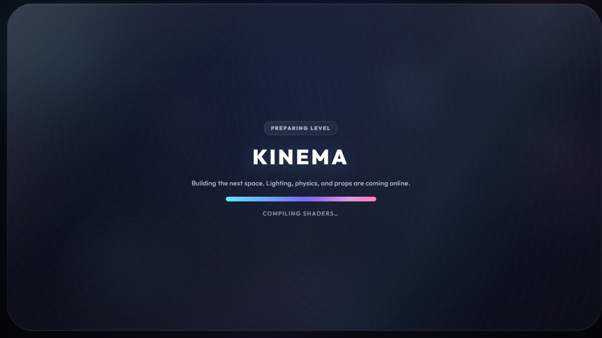

# KIN-029 Load And Physics-Cost Evidence

Captured 2026-07-21 on Windows at 1280x720. Every timing run used a fresh browser process. The comparable before/after series used Playwright Chromium with the repository's SwiftShader flags; installed Chrome with the NVIDIA WebGPU adapter was a separate renderer validation.

## Cold-load result

| Measurement | Before runs (ms) | After runs (ms) | Median change |
| --- | --- | --- | --- |
| Dev Play to interactive | 45,922; 42,875; 45,083 | 27,473; 31,516; 29,302 | 45,083 to 29,302 (-35.0%) |
| Dev procedural scene build | 26,946; 25,036; 25,473 | 9,968; 13,722; 10,349 | 25,473 to 10,349 (-59.4%) |
| Production Play to interactive | 44,935; 43,742; 47,222 | 28,445; 28,669; 42,546 | 44,935 to 28,669 (-36.2%) |

The original 4s production target was measured on a different baseline machine and is not achievable on this host's SwiftShader path. Three installed-Chrome runs using the NVIDIA `blackwell` WebGPU adapter completed in 7,141ms, 7,226ms, and 9,790ms (7,226ms median) with zero console/page errors after the r183 workaround. The same path showed `WebGPU · balanced` in the renderer badge.

Representative final dev breakdown (the median interactive run):

| Stage | Time (ms) |
| --- | ---: |
| Prepare | 2,006.3 |
| Procedural scene build | 10,348.7 |
| Player/game setup | 14.5 |
| Covered shader warmup | 15,085.5 |
| Loading fade/reveal | 1,844.9 |
| Play to interactive | 29,302.3 |

Navigation generation took 95.6ms in the Worker and became ready 25,457.3ms after the procedural build began. It did not gate `LevelManager.load`; five agents appeared only after `navigation:ready`.

## Renderer warmup decision

The task card proposed `WebGPURenderer.compileAsync(scene, camera)`. On Three r183, real-Chrome A/B runs of this node-heavy scene consistently logged a Dawn validation error on the next frame:

```text
THREE.[RenderPassEncoder (unlabeled)] was already ended.
```

`?warmup=0` and exact-hidden-render-only runs logged no errors. The final implementation therefore drains renderer mutations, disables renderable-object frustum culling temporarily, renders the exact active pipeline once behind the loading overlay, and restores culling in `finally`. This compiles scene and post-processing variants without the invalid r183 transition. `?warmup=0|false` remains the full escape hatch.

The final isolated installed-Chrome `?station=vfx` reveal recorded one 3,261.6ms boundary interval containing the covered hidden work. The following 59 revealed frames had p95/max 10.1ms and zero intervals over 50ms. The run logged zero console/page errors.

All four tested paths observe the new stage: default advanced renderer, forced WebGPU-on-WebGL2, compatibility WebGLRenderer, and bare compatibility. `?warmup=0` omits it and records `shaderWarmup: 0`.



## Physics, navigation, and frame evidence

Final full-showcase collider inventory:

| Rapier shape | Count |
| --- | ---: |
| Ball | 13 |
| Cuboid | 152 |
| Cylinder | 4 |
| TriMesh | 0 |
| Total | 169 |

The physics browser gate raycasts every authored slope at its rendered center and asserts the hit normal for 23.5°, 43.1°, and 62.7°. It also grounds the player on the two slopes within the configured 45° walkable limit. Steps, materials, and navigation assert their primitive-shape floors; navigation reaches five agents after readiness.

On the same SwiftShader dev path, three fresh-process 120-frame windows per station measured:

| Station | Before p95 runs (ms) | After p95 runs (ms) | Median change |
| --- | --- | --- | --- |
| Steps | 200.0; 200.1; 183.3 | 199.9; 183.4; 200.0 | 200.0 to 199.9 (-0.1%) |
| Materials | 200.1; 200.1; 200.0 | 200.0; 200.0; 200.0 | 200.1 to 200.0 (-0.1%) |

Both stations held a 66.7ms median p50 before and after. These absolute frame numbers are software-renderer-bound and are recorded as no-regression evidence, not a hardware performance claim; isolated maximums remained noisy and were not used as the decision metric.

## Verification notes

- Full units: 93 files / 754 tests passed.
- Browser gates: physics 11/11, station sweep 16/16, procedural review 1/1, procedural coins/hazards 8/8, and mobile compatibility 2/2 passed serially. The visual renderer suite passed 8/9 in its aggregate run; the sole animated bare-compat capture passed immediately when rerun alone, and the two initially skipped AA/bypass checks passed 2/2.
- Static gates: TypeScript and production build passed; the exact 27-file Biome check passed with zero errors. Repository lint improved from the documented 132-error baseline to 127 errors (272 warnings, 11 infos) and remains non-zero for unrelated baseline findings.
- Native WebGPU, bundled WebGPU-on-WebGL2, compatibility, and warmup bypass were exercised in Chrome/Playwright.
- The first combined long browser command lost its Playwright-managed Vite server; its `ERR_CONNECTION_REFUSED` results were discarded. Reruns used a separately owned Vite process.
- Full-procedural traces can still include late skinned-model compilation when asynchronous navigation-agent models replace their placeholder capsules. The required isolated VFX first-look trace is clean after its covered boundary interval.
